# Opportunity Market Lifecycle

This document describes the complete lifecycle of an Opportunity Market from creation to reward distribution.

## Overview

Opportunity Markets allow users to influence decision making by staking. Decision makers benefit from opportunity markets by getting access to high-quality signals, helping them make the best choice.

1. A **decision maker** creates a market with a reward pool
3. **Participants** stake on their preferred options with encrypted votes and can create new options
4. The **decision maker** sees individual votes (disclosed to them) but others cannot
5. After selecting a winner, participants who backed it share the reward proportionally

The protocol sets itself apart from other voting protocols with **confidential stake-to-vote mechanism** and **an arbitrary number of options**.

A opportunity market progresses through distinct phases with time limits. A description of these phases follows.

---

## Phase 1: Market Setup (Decision Maker)

The decision maker creates and configures the market.

### Step 1.1: Create Market

**Instruction:** [`create_market`](../programs/opportunity_market/src/instructions/create_market.rs)

The decision maker initializes a new market with:
- Reward pool size (in lamports)
- Duration of staking period
- Duration of reveal period
- Optional authority account that enables another signer to select the winning result

**What happens:**
- Market PDA is created with configuration
- MPC circuit initializes encrypted available shares
- Market is in "draft" state (not yet open for staking)

### Step 1.2: Add Options

**Instruction:** [`add_market_option`](../programs/opportunity_market/src/instructions/add_market_option.rs)

The market creator or the wider public can now add new options to vote for.

**Note:** Options can be added also after the market is open, until a winning option is selected.

### Step 1.3: Fund & Open Market

**Instruction:** [`open_market`](../programs/opportunity_market/src/instructions/open_market.rs)

The market must be funded with the reward lamports before this instruction can be called.
The creator, or anyone for that matter, can send the reward amount to the market's PDA.
This can also be done in the same transaction as the market opening.

This instruciton takes an open timestamp as argument.

**What happens:**
- Validates market has sufficient funding
- Sets `open_timestamp` - staking can start from this time onwards
- Market transitions from draft to active

---

## Phase 2: Participant Setup

Participants prepare to stake by setting up their accounts. 

### Step 2.1: Initialize Vote Token Account

**Instruction:** [`init_vote_token_account`](../programs/opportunity_market/src/instructions/init_vote_token_account.rs)

Each participant needs a vote token account (VTA) to hold their encrypted balance.
The VTA is tied to a participant wallet address, not any specific market, and is used for staking across different opportunity markets.

**What happens:**
- Creates VoteTokenAccount PDA for the participant
- MPC initializes encrypted balance to 0

### Step 2.2: Purchase Vote Tokens

**Instruction:** [`mint_vote_tokens`](../programs/opportunity_market/src/instructions/mint_vote_tokens.rs)

Convert SOL to vote tokens at a constant price. Vote tokens are essentially just a privacy-enabling wrapper around SOL.

**What happens:**
- SOL transfers from participant's wallet to VTA PDA
- MPC adds tokens to encrypted balance
- Participant can now purchase market shares

---

## Phase 3: Staking Period

During the staking period (`open_timestamp` to `open_timestamp + time_to_stake`), participants buy shares for their preferred options.

### Step 3.1: Initialize Share Account

**Instruction:** [`init_share_account`](../programs/opportunity_market/src/instructions/init_share_account.rs)

Creates a share account for the specific market.

This account keeps track of the participant's purchased shares and which option they voted for.
These values are encrypted and only visible to the participant and the decision maker.

### Step 3.2: Buy Market Shares

**Instruction:** [`buy_market_shares`](../programs/opportunity_market/src/instructions/buy_market_shares.rs)

This is the core voting action. The participant encrypts their vote client-side and passes it to the instruction.

**What happens:**
- MPC decrypts inputs, validates balances
- Deducts from  participant's vote token balance
- Deducts from market's available shares
- Stores encrypted position in share account (only decryptable by participant and decision maker)
- Records `bought_at_timestamp` for conviction scoring

---

## Phase 4: Decision & Resolution

After reviewing disclosed votes, the decision maker selects a winner.

### Step 4.1: Select Winning Option

**Instruction:** [`select_option`](../programs/opportunity_market/src/instructions/select_option.rs)

This instruction takes as input the 1-based index of the selected option.

**What happens:**
- Sets `selected_option` on the market
- If still in staking period, immediately ends it
- Enables the reveal phase

**Note:** Idea is the decision maker has been monitoring disclosed votes throughout the staking period to make an informed decision.

---

## Phase 5: Reveal Period

After a winner is selected, positions are revealed and tallied. This phase runs from `stake_end` to `stake_end + time_to_reveal`.

### Step 5.1: Reveal Shares

**Instruction:** [`reveal_shares`](../programs/opportunity_market/src/instructions/reveal_shares.rs)

This instruciton is permissionless; anyone can reveal anyone else's shares.

**What happens:**
- MPC decrypts share position
- Writes plaintext `revealed_amount` and `revealed_option` to share account
- Credits vote tokens back to participant's VTA (encrypted)

**Note:** Because the instruction is permissionless, this step can be automated.
Participants don't have to come back to the application to manually reveal their vote.

### Step 5.2: Increment Option Tally

**Instruction:** [`increment_option_tally`](../programs/opportunity_market/src/instructions/increment_option_tally.rs)

Adds revealed shares to the option's total (also permissionless).

**What happens:**
- Adds `revealed_amount` to `option.total_shares`
- Calculates conviction score: `amount * time_in_market`
- Adds score to `option.total_score`
- Marks share account as tallied

---

## Phase 6: Claim Rewards

After the reveal period ends, participants can close their accounts and claim rewards.

### Step 6.1: Close Share Account & Claim Reward

**Instruction:** [`close_share_account`](../programs/opportunity_market/src/instructions/close_share_account.rs)

**What happens:**
- If participant voted for winning option AND incremented tally:
  - Calculates proportional reward: `(participant_score / total_score) * reward_lamports`
  - Transfers reward from market to participant wallet
- Closes share account (rent returned to owner)

### Step 6.2: Claim Vote Tokens (Optional)

**Instruction:** [`claim_vote_tokens`](../programs/opportunity_market/src/instructions/claim_vote_tokens.rs)

Participants can sell remaining vote tokens back for SOL.

**What happens:**
- MPC validates balance and deducts tokens
- SOL transferred from VTA to participant wallet

---

## Complete Flow Diagram

```mermaid
sequenceDiagram
    box Decision Maker
        participant DM as Decision Maker
    end
    box Participants
        participant P as Participant
    end

    Note over DM,P: SETUP PHASE
    DM->>DM: create_market
    DM->>DM: add_market_option
    P->>P: add_market_option
    DM->>DM: Fund market (SOL transfer)
    DM->>DM: open_market

    Note over P: PARTICIPANT SETUP
    P->>P: init_vote_token_account
    P->>P: mint_vote_tokens

    rect rgb(1, 30, 20)
        Note over DM,P: STAKING PERIOD
        P->>P: init_share_account
        P->>P: buy_market_shares
        DM-->>P: (reads disclosed votes)
    end

    DM->>DM: select_option

    rect rgb(24, 5, 50)
        Note over DM,P: REVEAL PERIOD
        P->>P: reveal_shares
        P->>P: increment_option_tally
    end

    Note over DM,P: CLAIM PHASE
    P->>P: close_share_account (claim reward)
    P->>P: claim_vote_tokens (withdraw SOL)

    Note over DM: DONE
    Note over P: DONE
```

