# Conviction Market Lifecycle

This document describes the complete lifecycle of a Conviction Market from creation to reward distribution.

## Overview

Conviction Markets allow users to influence decision making by staking. Decision makers benefit from conviction markets by getting access to high-quality signals, helping them make the best choice.

1. A **decision maker** creates a market with a reward pool
2. **Participants** stake on their preferred options with encrypted votes
3. The **decision maker** sees individual votes (disclosed to them) but others cannot
4. After selecting a winner, participants who backed it share the reward proportionally

The market progresses through distinct phases with time-based transitions:


---

## Phase 1: Market Setup (Decision Maker)

The decision maker creates and configures the market.

### Step 1.1: Create Market

**Instruction:** [`create_market`](./ixs/create-market.md)

The decision maker initializes a new market with:
- Maximum number of voting options
- Total shares available for purchase
- Reward pool size (in lamports)
- Duration of staking period
- Duration of reveal period
- Optional alternative select authority

```typescript
await program.methods
  .createMarket(
    marketIndex,           // u64: unique identifier
    computationOffset,     // u64: MPC computation ID
    maxOptions,            // u16: max voting options (e.g., 5)
    maxShares,             // u64: total purchasable shares (e.g., 1000)
    rewardLamports,        // u64: reward pool (e.g., 1 SOL)
    timeToStake,           // u64: staking duration in seconds
    timeToReveal,          // u64: reveal duration in seconds
    nonce,                 // u128: encryption nonce
    selectAuthority,       // Option<Pubkey>: alternative authority
  )
  .accounts({...})
  .rpc();
```

**What happens:**
- Market PDA is created with configuration
- MPC circuit initializes encrypted available shares
- Market is in "draft" state (not yet open for staking)

### Step 1.2: Add Options

**Instruction:** [`add_market_option`](./ixs/add-market-option.md)

Add voting options one by one:

```typescript
await program.methods
  .addMarketOption(1, "Option A")  // index must be sequential: 1, 2, 3...
  .accounts({ creator, market, option: optionPDA })
  .rpc();
```

**Note:** Anyone can add new options. Options can be added also after the market is open, until a winning option is selected.

### Step 1.3: Fund & Open Market

**Instruction:** [`open_market`](./ixs/open-market.md)

First, transfer the reward lamports to the market PDA:

```typescript
// Transfer reward to market PDA
const tx = new Transaction().add(
  SystemProgram.transfer({
    fromPubkey: creator,
    toPubkey: marketPDA,
    lamports: rewardLamports,
  })
);
await sendTransaction(tx);
```

Then open the market with a future timestamp:

```typescript
await program.methods
  .openMarket(new BN(openTimestamp))
  .accounts({ creator, market })
  .rpc();
```

**What happens:**
- Validates market has sufficient funding
- Sets `open_timestamp` - staking begins at this time
- Market transitions from draft to active

---

## Phase 2: Participant Setup

Participants prepare to stake by setting up their accounts.

### Step 2.1: Initialize Vote Token Account

**Instruction:** [`init_vote_token_account`](./ixs/init-vote-token-account.md)

Each participant needs a vote token account to hold their encrypted balance:

```typescript
await program.methods
  .initVoteTokenAccount(computationOffset, x25519PublicKey, nonce)
  .accounts({ signer: user, voteTokenAccount: vtaPDA, ... })
  .rpc();

// Wait for MPC to complete
await awaitComputationFinalization(provider, computationOffset, programId);
```

**What happens:**
- Creates VoteTokenAccount PDA for the user
- MPC initializes encrypted balance to 0

### Step 2.2: Purchase Vote Tokens

**Instruction:** [`mint_vote_tokens`](./ixs/mint-vote-tokens.md)

Convert SOL to vote tokens (0.001 SOL per token):

```typescript
const amount = 100; // Buy 100 vote tokens (costs 0.1 SOL)
await program.methods
  .mintVoteTokens(computationOffset, x25519PublicKey, new BN(amount))
  .accounts({ signer: user, ... })
  .rpc();

await awaitComputationFinalization(provider, computationOffset, programId);
```

**What happens:**
- SOL transfers from user to VTA PDA
- MPC adds tokens to encrypted balance
- User can now purchase market shares

---

## Phase 3: Staking Period

During the staking period (`open_timestamp` to `open_timestamp + time_to_stake`), participants buy shares for their preferred options.

### Step 3.1: Initialize Share Account

**Instruction:** [`init_share_account`](./ixs/init-share-account.md)

Create a share account for the specific market:

```typescript
await program.methods
  .initShareAccount(stateNonce)
  .accounts({ signer: user, market: marketPDA, shareAccount: shareAccountPDA })
  .rpc();
```

### Step 3.2: Buy Market Shares

**Instruction:** [`buy_market_shares`](./ixs/buy-market-shares.md)

This is the core voting action. The user encrypts their vote client-side:

```typescript
// Client-side encryption
const buyAmount = BigInt(50);      // Buy 50 shares
const selectedOption = BigInt(1);   // Vote for option 1
const inputNonce = randomBytes(16);

// Encrypt inputs with shared key
const ciphertexts = cipher.encrypt([buyAmount, selectedOption], inputNonce);

// Submit encrypted vote
await program.methods
  .buyMarketShares(
    computationOffset,
    Array.from(ciphertexts[0]),      // encrypted amount
    Array.from(ciphertexts[1]),      // encrypted option
    x25519PublicKey,
    inputNonce,
    authorizedReaderPubkey,          // Decision maker's key
    disclosureNonce,
  )
  .accounts({ signer: user, market, userVta, shareAccount, ... })
  .rpc();

await awaitComputationFinalization(provider, computationOffset, programId);
```

**What happens:**
- MPC decrypts inputs, validates balances
- Deducts from user's vote token balance
- Deducts from market's available shares
- Stores encrypted position in share account
- Creates disclosure encrypted for authorized reader (decision maker)
- Records `bought_at_timestamp` for conviction scoring

---

## Phase 4: Decision & Resolution

After reviewing disclosed votes, the decision maker selects a winner.

### Step 4.1: Select Winning Option

**Instruction:** [`select_option`](./ixs/select-option.md)

```typescript
const winningOptionIndex = 1; // Option 1 wins
await program.methods
  .selectOption(winningOptionIndex)
  .accounts({ authority: creator, market })
  .rpc();
```

**What happens:**
- Sets `selected_option` on the market
- If still in staking period, immediately ends it
- Enables the reveal phase

**Note:** Idea is the decision maker has been monitoring disclosed votes throughout the staking period to make an informed decision.

---

## Phase 5: Reveal Period

After a winner is selected, positions are revealed and tallied. This phase runs from `stake_end` to `stake_end + time_to_reveal`.

### Step 5.1: Reveal Shares

**Instruction:** [`reveal_shares`](./ixs/reveal-shares.md)

Anyone can reveal any user's shares (permissionless):

```typescript
await program.methods
  .revealShares(computationOffset, ownerX25519PublicKey)
  .accounts({
    signer: anyone,
    owner: shareOwner,
    market,
    shareAccount,
    userVta,
    ...
  })
  .rpc();

await awaitComputationFinalization(provider, computationOffset, programId);
```

**What happens:**
- MPC decrypts share position
- Writes plaintext `revealed_amount` and `revealed_option` to share account
- Credits vote tokens back to user's VTA (encrypted)

**Note:** Because the instruction is permissionless, this step can be automated. User's don't have to come back to the application to manually reveal their vote.

### Step 5.2: Increment Option Tally

**Instruction:** [`increment_option_tally`](./ixs/increment-option-tally.md)

Add revealed shares to the option's total (also permissionless):

```typescript
await program.methods
  .incrementOptionTally(revealedOptionIndex)
  .accounts({
    signer: anyone,
    owner: shareOwner,
    market,
    shareAccount,
    option: optionPDA
  })
  .rpc();
```

**What happens:**
- Adds `revealed_amount` to `option.total_shares`
- Calculates conviction score: `amount * time_in_market`
- Adds score to `option.total_score`
- Marks share account as tallied

---

## Phase 6: Claim Rewards

After the reveal period ends, users can close their accounts and claim rewards.

### Step 6.1: Close Share Account & Claim Reward

**Instruction:** [`close_share_account`](./ixs/close-share-account.md)

```typescript
await program.methods
  .closeShareAccount(revealedOptionIndex)
  .accounts({ owner: user, market, shareAccount, option: optionPDA })
  .rpc();
```

**What happens:**
- If user voted for winning option AND incremented tally:
  - Calculates proportional reward: `(user_score / total_score) * reward_lamports`
  - Transfers reward from market to user
- Closes share account (rent returned to owner)

### Step 6.2: Claim Vote Tokens (Optional)

**Instruction:** [`claim_vote_tokens`](./ixs/claim-vote-tokens.md)

Users can sell remaining vote tokens back for SOL:

```typescript
await program.methods
  .claimVoteTokens(computationOffset, x25519PublicKey, new BN(remainingTokens))
  .accounts({ signer: user, ... })
  .rpc();

await awaitComputationFinalization(provider, computationOffset, programId);
```

**What happens:**
- MPC validates balance and deducts tokens
- SOL transferred from VTA to user

---

## Complete Flow Diagram

```mermaid
sequenceDiagram
    box Decision Maker
        participant DM as Decision Maker
    end
    box Participants
        participant P as Participant
    end

    Note over DM: SETUP PHASE
    DM->>DM: 1. create_market
    DM->>DM: 2. add_market_option (×N)
    DM->>DM: 3. Fund market (SOL transfer)
    DM->>DM: 4. open_market

    Note over P: PARTICIPANT SETUP
    P->>P: 5. init_vote_token_account
    P->>P: 6. mint_vote_tokens

    rect rgb(4, 41, 14)
        Note over DM,P: STAKING PERIOD
        DM-->>P: (reads disclosed votes)
        P->>P: 7. init_share_account
        P->>P: 8. buy_market_shares
    end

    DM->>DM: 9. select_option

    rect rgb(24, 4, 41)
        Note over DM,P: REVEAL PERIOD
        P->>P: 10. reveal_shares
        P->>P: 11. increment_option_tally
    end

    Note over DM,P: CLAIM PHASE
    P->>P: 12. close_share_account (claim reward)
    P->>P: 13. claim_vote_tokens (withdraw SOL)

    Note over DM: DONE
    Note over P: DONE
```


